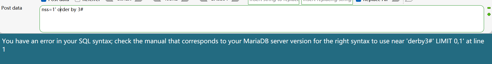
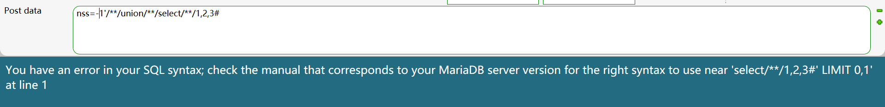

##### [SWPUCTF 2021 新生赛]sql

[NSS](https://www.ctfer.vip/problem/442)

- 经测试，过滤了空格、+、=、“table_name”字符串 。
- 最后爆值时，flag 只有一部分，猜测是存在输出长度限制，需要使用 mid() 等函数分批读取。

##### [SWPUCTF 2022 新生赛]ez_sql

[NSS](https://www.ctfer.vip/problem/2881)

- 

  order by 3# 变成了 derby3# ，可知过滤了空格、替换 or 为空。

- 

  union/\**/select/**/1,2,3# 变成了 select/\*\*/1,2,3# ，可知过滤了 union 。

- 其余操作略。