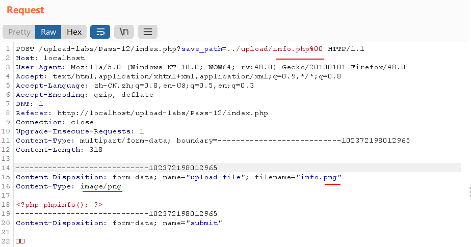
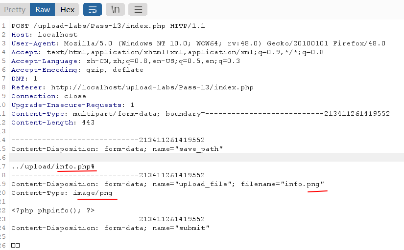
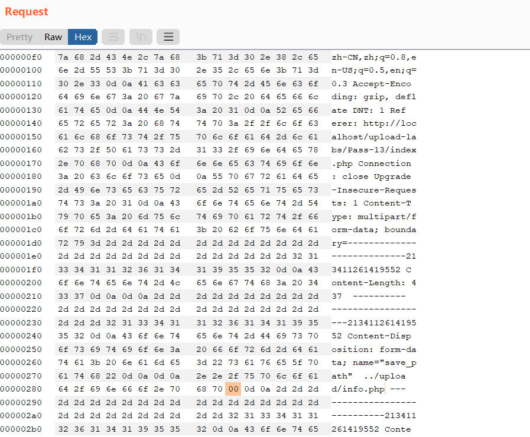
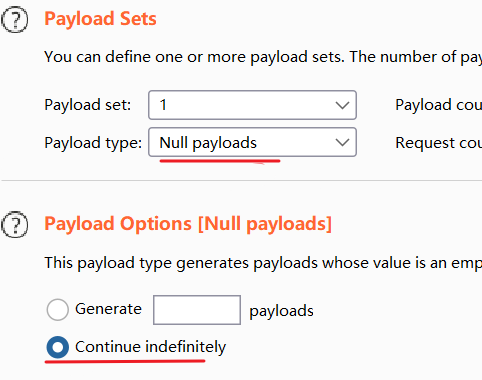

#### 【概述】

###### 查看Apache版本

&emsp;&emsp;本地 upload-labs 使用的是 phpStudy 搭建的，但 phpStudy 操作面板里没有显示 Apache 版本。

&emsp;&emsp;在 phpStudy 安装目录里找到 Apache/ 目录，在此打开命令行窗口，输入 `httpd -v` 即可，本地显示为 2.4.43 。

###### NOTICE

&emsp;&emsp;仅记录部分重要的关卡。

#### 【wp】

###### Pass-01 客户端验证

- 禁用 JS 。
- 删除表单处的 onsubmit 。
- 先改扩展名，抓包再改回来。

以上三种方法均可。

###### Pass-02 MIME类型验证

&emsp;&emsp;抓包，修改 MIME 类型。建议改为 image/gif ，方便实战时打组合拳。

###### Pass-03 Apache解析漏洞

&emsp;&emsp;环境模拟：打开配置文件 httpd.conf，Ctrl+F 找到 AddType application/x-httpd-php 处，把 # 去掉，保存、重启。

&emsp;&emsp;抓包，把扩展名改为 .phtml 即可。

&emsp;&emsp;此配置信息是告诉 Apache 服务器，把扩展名是这几个的文件当 php 文件来解析，所以你往里加 .fuck 也一样当 php 来解析。其本身配置信息里只有 .php 和 .phtml，其他的如 .php1、.php3、.pht什么的，除 ctf 题外，实际情况下一般不会冒着风险往里加这些吧。

###### Pass-04 .htaccess

&emsp;&emsp;.htaccess 是一个配置文件，运行于 Apache 上，需要把 httpd.conf 里 AllowOverride 处全改为 All 才允许 Apache 启用 .htaccess 文件。此时，当 .htaccess 文件被放置在一个通过 Apache 加载的目录中时，.htaccess 文件会被 Apache 检测并执行，.htaccess 文件将覆盖  Apache 的原配置文件 httpd.conf 。注意，.htaccess 文件仅作用于所在目录及其子目录，即如果下面的图片马存放在 .htaccess 文件所在目录的父目录的话，访问图片马将还是显示图片。

&emsp;&emsp;环境模拟：更改 httpd.conf 相关设置，保存、重启。

&emsp;&emsp;创建一个 .htaccess 文件，写入：

```
SetHandler application/x-httpd-php
```

即让  Apache 把所有文件都当成 php 来解析，如果仅指定特定文件名当作 php 来解析，则写为：

```
<FilesMatch "文件名">
  SetHandler application/x-httpd-php
</FilesMatch>
```

（更多 .htaccess 内容的写入，用到时再 Google）。

&emsp;&emsp;下一步，先上传 .htaccess 文件，再上传图片马。

###### Pass-05 .user.ini

&emsp;&emsp;.ini 文件是 Windows 系统的配置文件，.user.ini 将覆盖 php 配置配置文件 php.ini，但 .user.ini 只能被 CGI／FastCGI 处理 。除了php.ini 外，PHP 还会从被执行的 php/ 目录开始一直上升到 web 根目录扫描 .ini 文件。如果被执行的 PHP 文件在 web 根目录之外，则只扫描该目录。注意，同 .htaccess，.user.ini 只能用于访问其所在目录及子目录下的文件时进行覆盖。

&emsp;&emsp;在 php.ini 文件中相关内容如下：

```
;;;;;;;;;;;;;;;;;;;;
; php.ini Options  ;
;;;;;;;;;;;;;;;;;;;;
; Name for user-defined php.ini (.htaccess) files. Default is ".user.ini"
;user_ini.filename = ".user.ini"

; To disable this feature set this option to empty value
;user_ini.filename =

; TTL for user-defined php.ini files (time-to-live) in seconds. Default is 300 seconds (5 minutes)
;user_ini.cache_ttl = 300
```

user_ini.filename 设定 PHP 在搜寻时的目标文件名，默认是 .user.ini ，如果都设定为空则不会搜寻。user_ini.cache_ttl 控制重新读取搜寻到的 .ini 文件的间隔时间，默认是 300 秒（5 分钟）。

&emsp;&emsp;.user.ini 解析成功需满足：

- 服务器脚本语言为 PHP 。

- 服务器使用 CGI/FastCGI 。

- 所在目录下要有可执行的 php 文件。

&emsp;&emsp;创建一个 .user.ini 文件，写入：

```
auto_prepend_file=test.jpg
```

什么意思，参考[这篇文章](https://blog.csdn.net/fdipzone/article/details/39064001?ops_request_misc=%257B%2522request%255Fid%2522%253A%2522164934542916780271514234%2522%252C%2522scm%2522%253A%252220140713.130102334..%2522%257D&request_id=164934542916780271514234&biz_id=0&utm_medium=distribute.pc_search_result.none-task-blog-2~all~sobaiduend~default-1-39064001.142%5Ev7%5Econtrol,157%5Ev4%5Econtrol&utm_term=auto_prepend_file&spm=1018.2226.3001.4187)（更多 .user.ini 内容的写入，用到时再 Google）。

&emsp;&emsp;先上传 .user.ini 文件，再上传 test.jpg（图片马或纯 php 语句等都行），然后访问上传目录下的 readme.php 即可（仅会显示 test.jpg 的内容）。注意，需要版本号后加有 -nts 的 php 版本才能成功解析 .user.ini ，因为只有加有 -nts 的 php 版本才使用 CGI/FastCGI 。区分二者，可在 phpinfo 里 Ctrl+F 搜索 Zend Extension Build 或 PHP Extension Build ，里面有 TS 的为非 -nts 版本，有 NTS 的为 -nts 版本。

###### Pass-06 大小写绕过

###### Pass-07 空格绕过

&emsp;&emsp;注意要抓包加。

###### Pass-08 加点绕过

&emsp;&emsp;注意要抓包加。

###### Pass-09 ::$DATA绕过

&emsp;&emsp;对于 Windows 系统，如果文件名后加 ::$DATA ，系统将不检查扩展名。将这样的文件上传到服务器后，由于 Windows 系统的特性，在磁盘中会忽略 ::$DATA 并将文件新建。 

&emsp;&emsp;注意要抓包加。

###### Pass-12 GET%00截断

&emsp;&emsp;php 解释器是 C 语言写的，C 语言中字符串结尾以 ASCII 码为 0 的字符 Null 为标志，其url 编码为 %00 。

&emsp;&emsp;php 的 %00 截断是 5.2.x 版本的一个漏洞，且需参数 magic_quotes_gpc 为 off 状态。如果为 on ，该字符会被加上一个反斜杠转义掉。

&emsp;&emsp;环境模拟：在 phpStudy2018 操作面板的“其他选项菜单->php扩展及设置->参数开关设置”里找到 magic_quotes_gpc 并将其关闭。

&emsp;&emsp;上传 info.php ，抓包做如下修改：



可查看到上传后文件名为 info.php 。

&emsp;&emsp;修改文件名为 info.png 、Content-Type 是为了绕过后端检测。将 save_path 修改后，后端 PHP 执行时会如下：$file_ext 为 .png，成功通过白名单检测；$temp_file 为 info.png ，$img_path为 ../upload/info.php%00/xxx.png ，执行 move_upload_file(info.png, ../upload/info.php%00/xxx.png) 时，将触发 %00 截断漏洞，保存文件名时 %00 后的会被全部忽略，最终为 ../upload/info.php 。可见靠拼接的上传路径并不安全。

###### Pass-13 POST%00截断

&emsp;&emsp;与上题类似，只不过 save_path 是通过 POST 传递的，因为 POST 传数据时用的不是 url 编码，所以这里改的地方有所不同。

&emsp;&emsp;抓包，更改这些地方：



在 info.php 后需要加一个字符占 Null 的位置，然后在 Hex 里找到该字符对应的编码（如%是25），将其改为 00 再发包即可：



可查看到上传后文件名为 info.php 。

###### Pass-14 文件幻术绕过

&emsp;&emsp;源码没用 getimagesize 函数，所以这样绕可行。

###### Pass-15 图片马绕过

&emsp;&emsp;本关使用了 getimagesize 函数，只能靠图片马绕过。

###### Pass-16 图片马绕过

&emsp;&emsp;本关没用 getimagesize 函数，但却有 exif_imagetype 函数，也只能靠图片马绕过。

###### Pass-17 二次渲染

&emsp;&emsp;二次渲染就是后端重写文件内容，imagecreatefromgif 函数这是进行二次渲染的核心函数。

&emsp;&emsp;imagecreatefromgif()：创建一块画布，并从 GIF 文件或 URL 地址载入一副图像。
&emsp;&emsp;imagecreatefromjpeg()：创建一块画布，并从 JPEG 文件或 URL 地址载入一副图像。
&emsp;&emsp;imagecreatefrompng()：创建一块画布，并从 PNG 文件或 URL 地址载入一副图像。

&emsp;&emsp;如何绕过？参考[这篇文章](https://xz.aliyun.com/t/2657#toc-1)。

&emsp;&emsp;一般的图片马里，php 语句都放在最后面，而经过二次渲染后，末尾的 php 语句将被擦除，所以将 php 语句放在中间就好了，但注意放的位置不当将导致图片无法显示。

###### Pass-18 条件竞争

&emsp;&emsp;查看源码发现它会先将文件保存再检查后缀，如果后缀不符合则删除文件。前后两步的执行是存在一定时间间隔的，而如果能卡在这段时间做一些小动作，那就能成功上传 php 文件。

&emsp;&emsp;创建 test.php ，写入：

```php
<?php fputs(fopen('info.php','w'), '<?php phpinfo(); ?>'); ?>
```

&emsp;&emsp;上传抓包，将包送到 Intruder 板块（爆破时用的，原理就是快速不断地发包），利用 Intruder 板块进行无字典无限次爆破：



&emsp;&emsp;访问 test.php ，同样地抓包进行无字典无限次爆破。接下来两个爆破组同时进行 Start attack ，等待跑出 200 状态码即可。

&emsp;&emsp;我们通过无限次发包 test.php 创造机会，同时无限次访问 test.php ，如果有一刻刚好在间隔时间里访问成功到了 test.php ，那么将会执行 test.php ——在同目录下创建 info.php 并写入 `<?php phpinfo(); ?>` ，条件竞争便绕过，不过这是一个概率事件。

