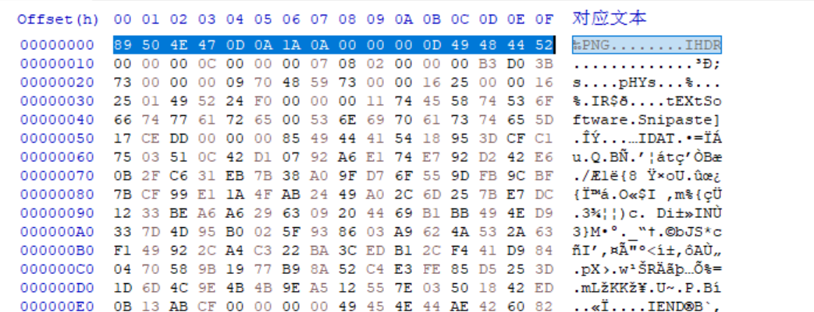

##### [SWPUCTF 2021 新生赛]easyupload2.0

[题目链接](https://www.ctfer.vip/problem/423)

- 上传 eval.php，抓包改为 eval.phtml 即可。

##### [SWPUCTF 2021 新生赛]easyupload1.0

[题目链接](https://www.ctfer.vip/problem/388)

- 上传 .htaccess 并改 MIME 类型。
- 上传图片马。
- 蚁剑链接，但找到的 flag 是错的，真正的在 phpinfo 里。

##### [SWPUCTF 2021 新生赛]easyupload3.0

[题目链接](https://www.ctfer.vip/problem/436)

- 上传 .htaccess 并改 MIME 类型。
- 上传图片马。

##### [GXYCTF 2019]BabyUpload

[题目链接](https://www.ctfer.vip/problem/1094)

- 上传图片进行测试时，出现：

  

  图片都传不了？不可能的，只是图片太大了。

- 上传 .htaccess 并改 MIME 类型。

- 上传图片马，注意有免杀。

  - `<?php ?>` 的其他写法：

    ```php
    1、<? ?> //亲测，无法解析
    2、<% %> //亲测，无法解析
    3、<script language="php></scrpt> //亲测有效
    4、<?= ?> //亲测有效
    ```

    

##### 攻防世界 easyupload

[题目链接](https://adworld.xctf.org.cn/challenges/details?hash=50df7052-1626-11ed-9827-fa163e4fa633&task_category_id=3)

- hint 藏得很细：

  

  可见那个小头像其实是从 upload/index.php 里加载的，访问它回显 File not found ，而不是 404 的界面，所以 upload 文件夹下确实存在 index.php 文件，很显然暗示传 .user.ini 。

- 上传 .user.ini ，注意有内容检测，需要添加文件幻术。

- 上传 eval.php ，抓包改为 eval.jpg 和改 MIME ，蚁剑连接 xxxxx/upload/index.php 。

##### [极客大挑战 2019]Upload

[题目链接](https://buuoj.cn/challenges#%5B%E6%9E%81%E5%AE%A2%E5%A4%A7%E6%8C%91%E6%88%98%202019%5DUpload)

- 上传 eval.php，抓包改为 eval.phtml ，注意有免杀和内容检测（添加文件幻术）。
- 也可以上传 .htaccess，但是后续传的图片马无法解析，可知 http.conf 里相关配置没改。

##### [ACTF2020 新生赛]Upload

[题目链接](https://buuoj.cn/challenges#%5BACTF2020%20%E6%96%B0%E7%94%9F%E8%B5%9B%5DUpload) 

- 发现存在客户端验证，ban 了。
- 上传 eval.php，抓包改为 eval.phtml 即可。
- 也可以大小写、加空格绕过，但是最终都无法解析，说明后端脚本不在 Windows 上运行。

##### [HarekazeCTF2019]Avatar Uploader 1

[题目链接](https://buuoj.cn/challenges#%5BHarekazeCTF2019%5DAvatar%20Uploader%201)

- 启动靶机：

  

  什么东西？随便输点东西，即可进入正常开局界面。

- 审源码，重点部分：

  - ```php
    // check whether file is uploaded
    if (!file_exists($_FILES['file']['tmp_name']) || !is_uploaded_file($_FILES['file']['tmp_name'])) {
      error('No file was uploaded.');
    }
    ```

    检查上传文件是否存在且是否由 POST 方式上传。

  - ```php
    // check file size
    if ($_FILES['file']['size'] > 256000) {
      error('Uploaded file is too large.');
    }
    ```

    检查文件大小。

  - ```php
    // check file type
    $finfo = finfo_open(FILEINFO_MIME_TYPE);
    $type = finfo_file($finfo, $_FILES['file']['tmp_name']);
    finfo_close($finfo);
    if (!in_array($type, ['image/png'])) {
      error('Uploaded file is not PNG format.');
    }
    ```

    检查文件类型，规定只能是 PNG 图片。

  - ```php
    // check file width/height
    $size = getimagesize($_FILES['file']['tmp_name']);
    if ($size[0] > 256 || $size[1] > 256) {
      error('Uploaded image is too large.');
    }
    if ($size[2] !== IMAGETYPE_PNG) {
      // I hope this never happens...
      error('What happened...? OK, the flag for part 1 is: <code>' . getenv('FLAG1') . '</code>');
    }
    ```

    检查文件宽高，注意到这里使用的是 getimagesize 函数，且如果图片类型不是 PNG 则输出 flag 。

    那么问题来了，上一步需要图片类型为 PNG 才能通过，而这里却需要图片类型不是 PNG 才会输出 flag ，前后矛盾，那么必定需要绕过一些函数。

- 了解到：

  - FILEINFO_MIME_TYPE：fileinfo 常量，返回 MIME 类型， 自 PHP 5.3.0 可用。
  - finfo_open(fileinfo常量)：对于过程化风格的写法，执行成功则返回一个表示魔数数据库的资源， 或者在失败时返回 false。
  - finfo_file(finfo_open函数所返回资源, 文件名)：返回文件类型。对于图片文件，仅检查该文件十六进制下的第一行信息。
  - getimagesize 函数不检查文件是否为真的图片。

- 所以，用 16 进制查看器打开一张大小合适的 PNG 图片，删除其余部分，只保留第一行（即能绕过 finfl_file 函数，又不是正常的 PNG 图），然后将其上传即可得 flag ：

  

- 常见文件头（16 进制下）：

  ```
  GIF：47 49 46 38 39 61
  png：89 50 4E 47 0D 0A 1A 0A
  JPG：FF D8 FF E0 00 10 4A 46 49 46
  ```

##### [UUCTF 2022 新生赛]ez_upload

[题目链接](https://www.ctfer.vip/problem/3094)

- 传 php 文件、图片马都行，抓包改为 eval.jpg.php 和改 MIME 类型即可。

- 这题其实是偶然试出来的，传 .htaccess 的时候，传不了，然后试了一下 .jpg.htaccess ，结果成功了，猜测应该是只要检测到文件名有 .jpg 等白名单扩展名就让过。 

- 官方 wp 说是 Apache 解析漏洞，即从右往左解析，遇到不认识的就跳过。但个人觉得似乎不是考察这个，就是只要检测到文件名有 .jpg 等白名单扩展名就让过。

- 源码如下：

  ```php
  <?php
  //echo $_FILES['file']['name'];echo '<br>';
  //echo $_FILES['file']['type'];echo '<br>';
  $flag1=true;
  $flag2=true;
  $file_name=$_FILES['file']['name'];
  $file_type=$_FILES['file']['type'];
  $allow_file_type=['image/jpeg','image/png'];
  $allowedExts = array("php", "php3", "php5", "phtml","htaccess");
  $ext=substr($file_name,strpos($file_name,".")+1);
  if(!in_array(strtolower($file_type),$allow_file_type)){
      $flag1=false;
      die("你好坏哦，不理你了");
  }
  if(in_array(strtolower($ext),$allowedExts)){
      $flag2=false;
      die("你好坏哦，不理你了");
  }
  if($flag1&&$flag2){
      if (file_exists("upload/" . $_FILES["file"]["name"]))
      {
          echo $_FILES["file"]["name"] . " 文件已经存在。 ";
      }
      else
      {
          // 如果 upload 目录不存在该文件则将文件上传到 upload 目录下
          move_uploaded_file($_FILES["file"]["tmp_name"], "upload/" . $_FILES["file"]["name"]);
          echo "文件存储在: " . "upload/" . $_FILES["file"]["name"];
      }
  }
  else{
      echo "Hacker，你好坏哟";
  }
  ```

  猜对了，但不完全对。这里是把文件名中第一个 . 后的扩展名做为该文件的扩展名，如果其存在于黑名单中，则赋 flag2 为 false ，那么其实文件名改为 eval.aaa.php 这样的也可以（实验证明确实可以），因为 aaa 不在黑名单里。

  
